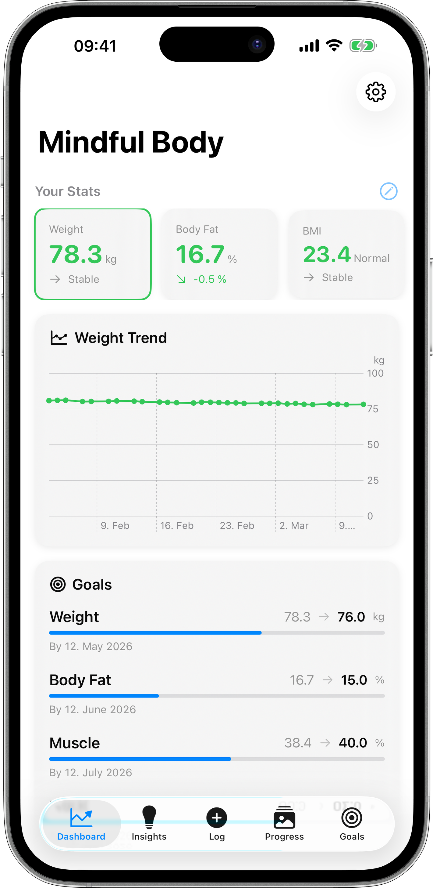
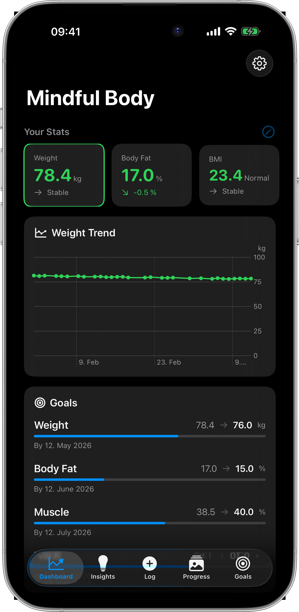
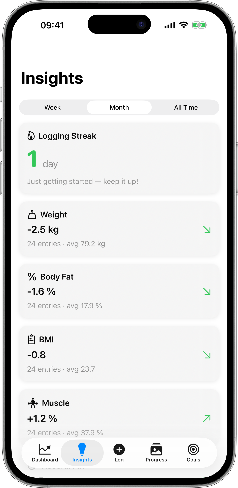
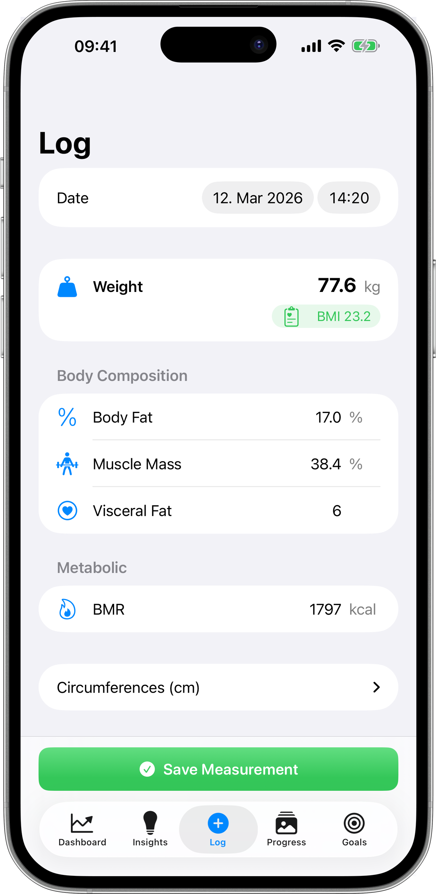
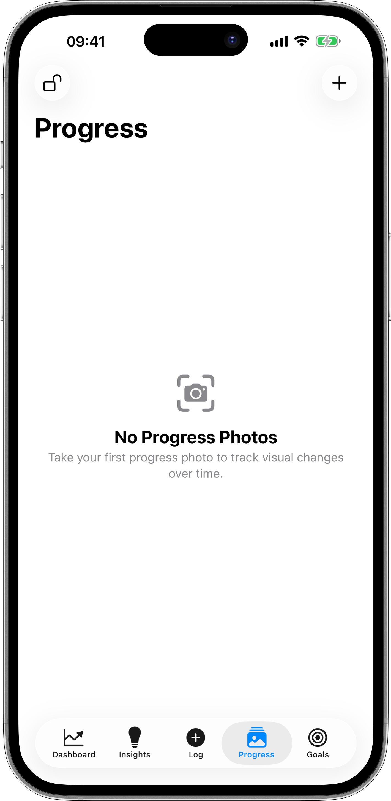
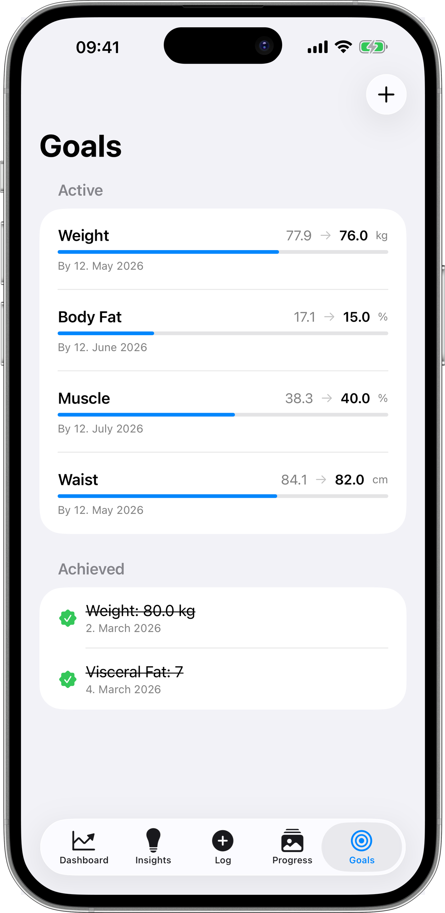

🇺🇸 [English](README.md) | 🇩🇪 [Deutsch](README_de.md) | 🇪🇸 [Español](README_es.md) | 🇫🇷 [Français](README_fr.md) | 🇯🇵 [日本語](README_ja.md) | 🇨🇳 **中文**

# Mindful Body – 支持 HealthKit 与 iCloud 同步的 iPhone 体脂追踪应用

  

**清晰自信地追踪你的身体变化之旅。**

Mindful Body 是一款精心设计的 iOS 应用，用于追踪体重、体脂率、肌肉量、围度等数据。设定目标，拍摄进度照片，获取数据驱动的洞察 — 全程支持 Apple Health 完整集成与 iCloud 跨设备同步。

与 [Mindful Coffee](https://github.com/aloth/mindful-coffee) 同为 **Mindful Apps** 系列应用。

## 为什么选择 Mindful Body？

大多数身体追踪应用只记录体重。Mindful Body 更进一步 — 追踪完整的身体成分，可视化长期趋势，并提供科学依据的洞察，帮你了解哪些方法有效。无论是减脂、增肌还是保持健康，这款应用都能为你呈现全面图景。

## 核心功能

### 📊 全面身体追踪

- **体重 & BMI** — 记录体重，根据身高自动计算 BMI
- **身体成分** — 追踪体脂率、肌肉量、内脏脂肪等级和基础代谢率（BMR）
- **围度测量** — 胸围、腰围、臀围、颈围、臂围和腿围 — 一处全部管理
- **智能单位** — 在公制（kg/cm）和英制（lbs/in）之间无缝切换

### 📈 洞察与趋势

- **趋势图表** — 每项指标的交互式图表，支持自定义时间范围
- **科学依据的洞察** — 了解体型重塑、代谢变化和围度趋势
- **记录连击** — 通过连击追踪和里程碑庆祝保持动力
- **目标感知仪表盘** — 当你朝目标稳步前进时，卡片变为绿色

### 🎯 目标设定

- **灵活目标** — 为体重、体脂、腰围或任何追踪指标设定目标
- **截止日期** — 可选的截止日期追踪，保持自律
- **成就追踪** — 达成目标时庆祝你的成就

### 📸 进度照片

- **Face ID 保护** — 生物识别认证确保照片隐私
- **姿势分类** — 按正面、背面、左侧、右侧整理
- **前后对比** — 与测量数据并排的视觉进度追踪
- **iCloud 同步** — 照片通过 CloudKit 在各设备间安全同步

### 💊 补剂追踪

- **自定义补剂** — 创建你自己的补剂（蛋白粉、肌酸、维生素等），设置默认剂量
- **服用提示** — 设置每种补充剂的服用时间（早上、训练前、训练后、睡前等）
- **一键记录** — 快速记录默认剂量或输入自定义用量
- **仪表盘卡片** — 一目了然地查看今日摄入状态
- **多次剂量支持** — 记录每日多次摄入及总量
- **统一历史** — 测量数据与补剂记录在同一时间线中

### ❤️ Apple Health 集成

- **双向同步** — 自动读取和写入 Apple Health
- **导入历史数据** — 从 HealthKit 导入最多 365 天的体重数据
- **多项指标** — 同步体重、体脂、BMI、去脂体重、腰围和 BMR

### ☁️ iCloud 同步

- **无缝多设备支持** — 所有测量数据、目标和进度照片通过 CloudKit 同步
- **同步状态仪表盘** — 查看同步状态、上次同步时间，并可按需强制同步
- **去重工具** — 内置维护功能，清理重复记录

### 🔔 智能提醒

- **每日称重** — 每天早晨温和提醒你踏上体重秤
- **每周检查** — 提醒进行全面的身体成分记录
- **每月进度照片** — 别忘了记录你的视觉进展

### 🌍 本地化

- **6 种语言** — 英语、德语、西班牙语、法语、日语和简体中文

## 截图

<table>
<tr>
<td width="50%">

### 你的完整仪表盘
体重、体脂、BMI、肌肉量 — 配合趋势图表和目标感知颜色编码，一目了然掌握所有关键指标。

</td>
<td width="50%">

### 深色模式同样美观
专为日夜使用设计，令人惊艳的深色主题，护眼舒适。

</td>
</tr>
<tr>
<td width="50%">

### 有意义的洞察
追踪连击记录，查看每周和每月平均值，获取关于身体成分变化的科学洞察。

</td>
<td width="50%">

### 记录一切
体重、体脂、肌肉量、BMR、内脏脂肪和围度 — 全部在一个简洁的表单中完成。

</td>
</tr>
<tr>
<td width="50%">

### 视觉进度
通过按姿势整理的 Face ID 保护进度照片，记录你的蜕变过程。

</td>
<td width="50%">

### 设定目标，保持动力
通过视觉指示器和成就庆祝追踪朝目标迈进的进度。

</td>
</tr>
</table>

## 隐私

Mindful Body 认真对待你的隐私：

- **不访问相册保存** — 进度照片存储在应用的私有容器中，从不保存到你的相册
- **Face ID 保护** — 进度照片可通过生物识别认证锁定
- **本地处理** — 所有计算均在本地完成
- **无分析或追踪** — 零第三方 SDK
- **iCloud 加密** — 同步数据在传输中和静态存储时均已加密
- **你的数据属于你** — 完整的数据导出功能

## 反馈与支持

帮助改进 Mindful Body：

- **报告错误：** [创建 Issue](https://github.com/aloth/mindful-body/issues/new?template=bug_report.yml)
- **建议功能：** [创建 Feature Request](https://github.com/aloth/mindful-body/issues/new?template=feature_request.yml)

## 相关项目

- [**Mindful Coffee**](https://github.com/aloth/mindful-coffee) — 智能咖啡因追踪，包含睡眠预测与皮质醇节律建模
- [**Trackless Links**](https://github.com/aloth/trackless-links) — 用于从 URL 中删除追踪器的 Safari 扩展

## 许可证

本仓库包含 Mindful Body 的文档、资源和支持文件。
应用源代码为专有软件。© 2026 Alexander Loth。保留所有权利。

---

  

